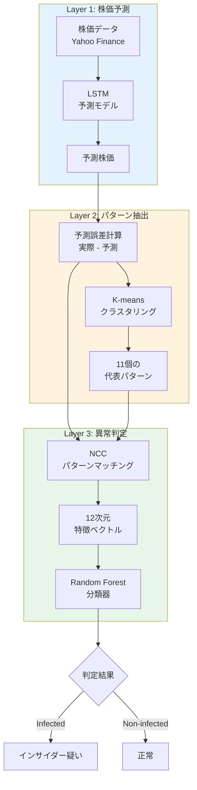
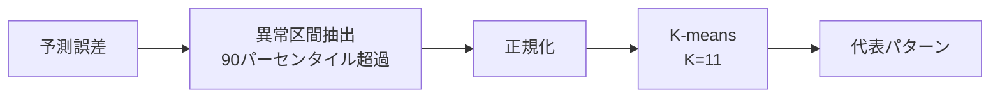
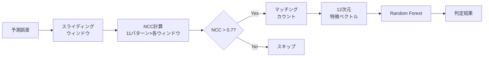
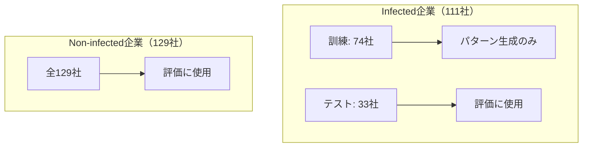

# インサイダー取引検出システム

**機械学習を用いた高精度インサイダー取引自動検出システム**

[](https://opensource.org/licenses/MIT)
[](https://www.python.org/downloads/)

---

## プロジェクト概要

本プロジェクトは、LSTM株価予測、パターンマッチング、機械学習分類を組み合わせた**三層構造のインサイダー取引検出システム**です。

### 主要成果

| 指標 | 値 |
|------|-----|
| **Precision（適合率）** | **96.6%** |
| **Recall（再現率）** | **84.8%** |
| **F1スコア** | **0.903** |
| **誤検出（FP）** | **1社のみ** |

---

## システムアーキテクチャ



---

## ディレクトリ構成

```
insider-trading-detection/
├── src/
│   ├── prediction/                  # Layer 1: LSTM株価予測
│   │   ├── lstm.py                 # LSTMモデル定義
│   │   ├── run.py                  # 予測実行スクリプト
│   │   └── output/                 # 予測結果（232社）
│   │
│   ├── detection/                   # Layer 2 & 3: 異常検出+分類
│   │   ├── main_detection.py       # メインパイプライン
│   │   ├── detect_anomaly.py       # 異常検出コア（NCC）
│   │   ├── input/
│   │   │   └── pattern.csv         # 11個の代表パターン
│   │   └── visualizations/         # 出力グラフ
│   │
│   └── data_source/                 # 教師データ管理
│       └── data/
│           ├── infected/           # インサイダー企業（111社）
│           └── non_infected/       # 正常企業（129社）
│
├── requirements.txt
├── setup.sh
└── README.md
```

---

## クイックスタート

### 1. リポジトリのクローン

```bash
git clone https://github.com/kenji200056/insider-trading-detection.git
cd insider-trading-detection
```

### 2. セットアップ

```bash
# セットアップスクリプトを実行（仮想環境作成 + 依存パッケージインストール）
chmod +x setup.sh
./setup.sh
```

または手動で：

```bash
python3 -m venv .venv
source .venv/bin/activate
pip install -r requirements.txt
```

### 3. 実行

```bash
cd src/detection
python main_detection.py
```

**実行時間**: 約3分

---

## 各モジュールの詳細

### Layer 1: 株価予測 (`prediction/`)

**目的**: LSTMを用いて株価を予測し、予測誤差を計算

**技術**:
- LSTM（Long Short-Term Memory）
- ウィンドウベースの時系列予測（50日間）

**出力**:
- `{company}_full_window_act.csv`: 実際の株価
- `{company}_full_window_pred.csv`: 予測株価

---

### Layer 2: パターン抽出 (`detection/`)

**目的**: 予測誤差から異常パターンを抽出

**アルゴリズム**:



1. 訓練Infected企業（74社）から異常区間を抽出
2. K-means（K=11）でクラスタリング
3. 各クラスタの中心に最も近いパターンを代表として選択

---

### Layer 3: 異常判定 (`detection/`)

**目的**: パターンマッチングと機械学習による最終判定

**処理フロー**:



**特徴ベクトル**: `[pattern_0, pattern_1, ..., pattern_10, total_count]`

---

## 手法の特徴

### 1. データリーク対策



**重要**: パターン生成に使った企業はテストに含めない

---

### 2. 正規化相互相関（NCC）

時系列の**形状**の類似度を計算：

$$
\text{NCC}(x, y) = \frac{\sum_i (x_i - \bar{x})(y_i - \bar{y})}{\sqrt{\sum_i (x_i - \bar{x})^2} \sqrt{\sum_i (y_i - \bar{y})^2}}
$$

- 値域: [-1, 1]
- 1に近い → 似た形状
- スケール不変（振幅の違いを吸収）

---

### 3. 多次元特徴量による高精度化

| 手法 | 特徴量 | Precision |
|------|--------|-----------|
| 閾値ベース | 異常件数のみ（1次元） | 20.9% |
| **本手法** | **11パターン+総数（12次元）** | **96.6%** |

**原理**:
- インサイダー取引 → 特定パターンに集中
- 通常の株価変動 → ランダムに分散

---

## 結果

### 混同行列

| | 予測: Infected | 予測: Non-infected |
|---|---|---|
| **実際: Infected** | TP: 28 | FN: 5 |
| **実際: Non-infected** | FP: 1 | TN: 124 |

- **誤検出（FP）**: わずか1社
- **見逃し（FN）**: 5社

---

## 使用技術

| カテゴリ | 技術 |
|---------|------|
| **深層学習** | LSTM（株価予測） |
| **クラスタリング** | K-means（パターン抽出） |
| **信号処理** | 正規化相互相関（NCC） |
| **機械学習** | Random Forest（分類） |

---

## カスタマイズ

`src/detection/main_detection.py` でパラメータを調整：

```python
# パターン数
n_clusters = 11

# NCC閾値
threshold = 0.7

# Random Forestパラメータ
clf = RandomForestClassifier(
    n_estimators=100,
    max_depth=5,
    class_weight={0:1, 1:2},
    random_state=42
)
```

---

## トラブルシューティング

### `FileNotFoundError`

```bash
# detection/から実行すること
cd src/detection
python main_detection.py
```

### `ModuleNotFoundError: No module named 'sklearn'`

```bash
source .venv/bin/activate
pip install scikit-learn
```

---

## ライセンス

MIT License

---

## 作成者

**Kenji Gutierrez Jimenez**

---

## 関連リソース

- [LSTM時系列予測の解説](https://colah.github.io/posts/2015-08-Understanding-LSTMs/)
- [Random Forestの原論文 (Breiman 2001)](https://link.springer.com/article/10.1023/A:1010933404324)
- [K-means Clustering](https://en.wikipedia.org/wiki/K-means_clustering)
