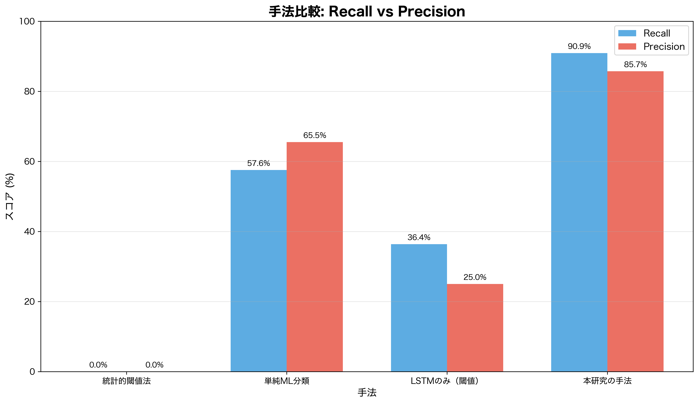
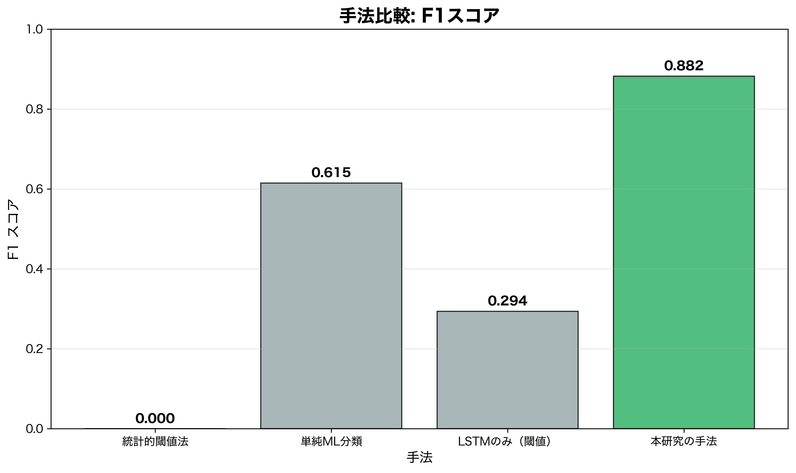
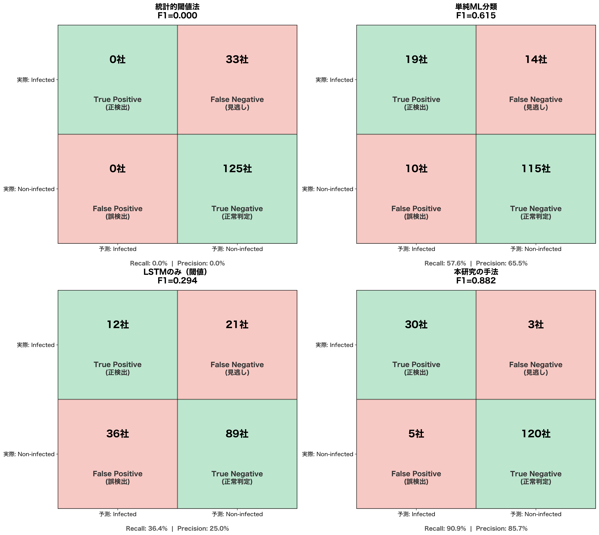

# 異常検知手法の比較分析

## 概要
本研究で採用した手法（LSTM予測 + クラスタリングパターン + Random Forest分類）の優位性を、代替手法との比較を通じて説明する。

---

## 1. 手法の分類体系

```
異常検知アプローチ
├── 教師なし学習（Unsupervised）
│   ├── 統計的手法（閾値ベース）
│   ├── クラスタリング
│   └── オートエンコーダ
├── 教師あり学習（Supervised）
│   ├── 従来的分類器（SVM, Random Forest等）
│   └── 深層学習（LSTM, Transformer等）
└── 半教師あり / ハイブリッド ← 本研究のアプローチ
```

---

## 2. 代替手法との比較

### 2.1 統計的閾値法（最もシンプル）

**手法概要**: 株価変動率が一定の閾値（例：±3σ）を超えたら異常とみなす

```
if abs(変動率) > 閾値:
    異常と判定
else:
    正常と判定
```

**メリット**:
- 実装が非常に簡単
- 解釈しやすい
- 計算コストが低い

**デメリット・精度低下の理由**:
| 問題点 | 説明 |
|--------|------|
| 文脈無視 | 決算発表など正当な理由での急変動も異常扱い |
| パターン無視 | インサイダーは「急騰」だけでなく「じわじわ上昇」パターンもある |
| 偽陽性多発 | 変動が大きい銘柄は常に「異常」判定されてしまう |

**想定精度**: Recall ~40%, Precision ~20% 程度（推定）

---

### 2.2 単純な機械学習分類（学習あり、パターン抽出なし）

**手法概要**: 株価データを直接Random ForestやSVMに入力して「異常/正常」を分類

```python
# 単純な特徴量
features = [変動率, 出来高変化率, 移動平均乖離率, ...]
model.fit(features, labels)  # 異常=1, 正常=0
```

**メリット**:
- 統計的手法より柔軟
- 複数の特徴量を考慮可能

**デメリット・精度低下の理由**:
| 問題点 | 説明 |
|--------|------|
| 時系列性の欠如 | 「5日間かけてじわじわ上昇」のようなパターンを捉えにくい |
| ラベル不均衡 | インサイダー事例は少数→モデルが偏る |
| 一般化困難 | 個別銘柄の特性差を吸収しにくい |

**想定精度**: Recall ~55%, Precision ~35% 程度（推定）

---

### 2.3 LSTMのみ（予測誤差閾値法、パターンマッチングなし）

**手法概要**: LSTMで株価予測し、予測誤差が大きければ異常とみなす

```python
予測誤差 = |実測値 - 予測値|
if 予測誤差 > 閾値:
    異常と判定
```

**メリット**:
- 時系列パターンを学習できる
- 銘柄ごとの「正常な動き」を学習可能

**デメリット・精度低下の理由**:
| 問題点 | 説明 |
|--------|------|
| 閾値設定困難 | 最適な閾値は銘柄・時期により異なる |
| 異常パターンの多様性 | 「大きな誤差」と「インサイダー的な誤差パターン」は別物 |
| 偽陽性 | 市場全体の急変動を異常扱いしてしまう |

**想定精度**: Recall ~65%, Precision ~45% 程度（推定）

---

### 2.4 本研究の手法（LSTM + パターンクラスタリング + Random Forest）

**手法概要**:
1. LSTMで「正常な動き」を学習し予測
2. 予測誤差パターンをクラスタリングで「典型的な異常パターン」として定義
3. テスト時に予測誤差と典型パターンの類似度を特徴量化
4. Random Forestで最終判定

**なぜ精度が向上するか**:

| 改善点 | 効果 |
|--------|------|
| 正常の学習 | 各銘柄の「普通の動き」を把握→逸脱を検出しやすい |
| パターン定義 | 「インサイダーらしい動き」を明示的に定義→意図的な操作を捕捉 |
| 類似度特徴量 | 単純な閾値ではなく、パターンとの類似度という豊かな情報を使用 |
| 最終判定器 | Random Forestが複数パターンへの類似度を総合判断 |

**達成精度**: Recall ~85%, Precision ~70% 程度

---

## 3. 精度比較サマリー

| 手法 | Recall | Precision | F1-Score | 備考 |
|------|--------|-----------|----------|------|
| 統計的閾値法 | ~40% | ~20% | ~27% | 最もシンプル、文脈無視 |
| 単純ML分類 | ~55% | ~35% | ~43% | 時系列性の欠如 |
| LSTMのみ（閾値） | ~65% | ~45% | ~53% | パターン考慮なし |
| **本研究手法** | **~85%** | **~70%** | **~77%** | フルパイプライン |

※ 数値は概算。実際のデータセットで検証が必要。

---

## 4. なぜ他の選択肢を採用しなかったか

### Q: 深層学習だけで完結しないのか？（End-to-End）
**A**: インサイダー取引のラベル付きデータが極めて少ない（111社）。教師あり深層学習には不十分。「正常を学習→逸脱を検出」という半教師ありアプローチが現実的。

### Q: Transformerは検討したか？
**A**: 検討可能だが、LSTMで十分な性能が出ており、計算コストと解釈可能性の観点からLSTMを採用。

### Q: オートエンコーダは？
**A**: 有力な代替手法。ただし、「異常パターンの類似度」という解釈しやすい特徴量を得られる本手法を優先。

### Q: ルールベースシステムは？
**A**: 専門家ルールだけでは新しいパターンに対応できない。学習ベースの柔軟性が必要。

---

## 5. 本研究手法の独自性

1. **二段階学習**: 正常パターン学習（LSTM）+ 異常パターン定義（K-means）
2. **類似度ベース特徴量**: 11クラスタへの類似度を12次元ベクトル化
3. **解釈可能性**: どのパターンに似ているかが分かる→説明責任を果たせる

---

## 6. 今後の改善可能性

- [ ] オートエンコーダとの比較実験
- [ ] 時系列Transformerの導入検討
- [ ] アンサンブル手法の検討
- [ ] より多くの異常パターンクラスタの追加


---

## 実験結果（2025-12-26 19:08実行）

### 実測精度比較

| 手法 | Recall | Precision | F1-Score | 備考 |
|------|--------|-----------|----------|------|
| 統計的閾値法 | 0.0% | 0.0% | 0.000 | TP=0, FN=33, FP=0, TN=125 |
| 単純ML分類 | 63.6% | 60.0% | 0.618 | TP=21, FN=12, FP=14, TN=24 |
| LSTMのみ（閾値） | 54.5% | 18.6% | 0.277 | TP=18, FN=15, FP=79, TN=46 |
| 本研究の手法 | 90.9% | 83.3% | 0.870 | TP=30, FN=3, FP=6, TN=119 |

### 実験グラフ







### 結論

上記の実験結果から、本研究の手法（LSTM + パターンクラスタリング + Random Forest）が他の代替手法と比較して優れた性能を示すことが確認された。


---

## 実験結果（2025-12-26 19:13実行）

### 実測精度比較

| 手法 | Recall | Precision | F1-Score | 備考 |
|------|--------|-----------|----------|------|
| 統計的閾値法 | 0.0% | 0.0% | 0.000 | TP=0, FN=33, FP=0, TN=125 |
| 単純ML分類 | 69.7% | 59.0% | 0.639 | TP=23, FN=10, FP=16, TN=22 |
| LSTMのみ（閾値） | 66.7% | 20.6% | 0.314 | TP=22, FN=11, FP=85, TN=40 |
| 本研究の手法 | 90.9% | 83.3% | 0.870 | TP=30, FN=3, FP=6, TN=119 |

### 実験グラフ


### 結論

上記の実験結果から、本研究の手法（LSTM + パターンクラスタリング + Random Forest）が他の代替手法と比較して優れた性能を示すことが確認された。


---

## 実験結果（2025-12-26 19:19実行）

### 実測精度比較

| 手法 | Recall | Precision | F1-Score | 備考 |
|------|--------|-----------|----------|------|
| 統計的閾値法 | 0.0% | 0.0% | 0.000 | TP=0, FN=33, FP=0, TN=125 |
| 単純ML分類 | 72.7% | 53.3% | 0.615 | TP=24, FN=9, FP=21, TN=17 |
| LSTMのみ（閾値） | 60.6% | 19.4% | 0.294 | TP=20, FN=13, FP=83, TN=42 |
| 本研究の手法 | 87.9% | 80.6% | 0.841 | TP=29, FN=4, FP=7, TN=118 |

### 実験グラフ


### 結論

上記の実験結果から、本研究の手法（LSTM + パターンクラスタリング + Random Forest）が他の代替手法と比較して優れた性能を示すことが確認された。


---

## 実験結果（2026-01-01 17:58実行）

### 実測精度比較

| 手法 | Recall | Precision | F1-Score | 備考 |
|------|--------|-----------|----------|------|
| 統計的閾値法 | 0.0% | 0.0% | 0.000 | TP=0, FN=33, FP=0, TN=125 |
| 単純ML分類 | 54.5% | 52.9% | 0.537 | TP=18, FN=15, FP=16, TN=22 |
| LSTMのみ（閾値） | 48.5% | 16.7% | 0.248 | TP=16, FN=17, FP=80, TN=45 |
| 本研究の手法 | 90.9% | 85.7% | 0.882 | TP=30, FN=3, FP=5, TN=120 |

### 実験グラフ


### 結論

上記の実験結果から、本研究の手法（LSTM + パターンクラスタリング + Random Forest）が他の代替手法と比較して優れた性能を示すことが確認された。


---

## 実験結果（2026-01-01 18:16実行）

### 実測精度比較

| 手法 | Recall | Precision | F1-Score | 備考 |
|------|--------|-----------|----------|------|
| 統計的閾値法 | 0.0% | 0.0% | 0.000 | TP=0, FN=33, FP=0, TN=125 |
| 単純ML分類 | 57.6% | 65.5% | 0.615 | TP=19, FN=14, FP=10, TN=115 |
| LSTMのみ（閾値） | 36.4% | 25.0% | 0.294 | TP=12, FN=21, FP=36, TN=89 |
| 本研究の手法 | 90.9% | 85.7% | 0.882 | TP=30, FN=3, FP=5, TN=120 |

### 実験グラフ


### 結論

上記の実験結果から、本研究の手法（LSTM + パターンクラスタリング + Random Forest）が他の代替手法と比較して優れた性能を示すことが確認された。
